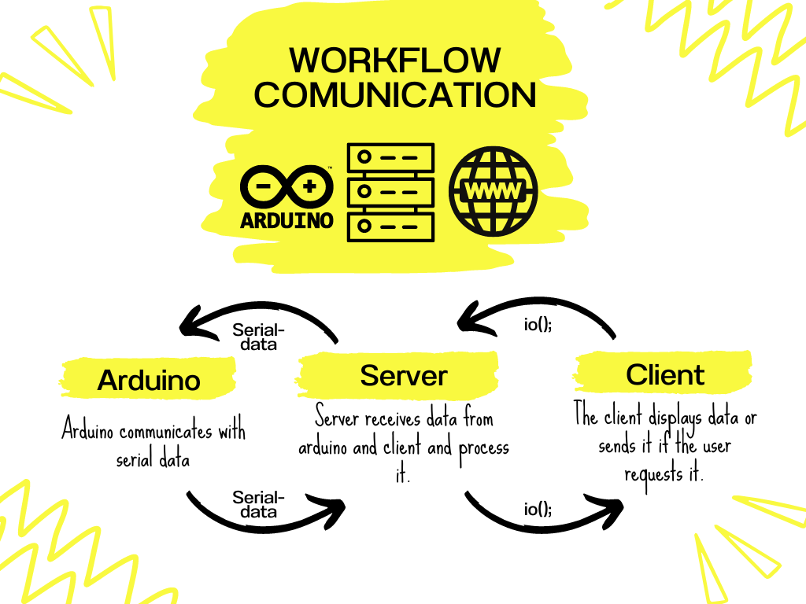

#   ARDUINO-JAVASCRIPT
This is a proyect that implements arduino, javascript, node.js, SerialPort.js, Express.js and Socket.io in order to we can get control over arduino.

#   Tecnologies
This proyect was made with libraries like express to create a server; socket.io to make a socket connection and serialJS to take control over arduino through a serial connection

    
    
    

# Work - flow
